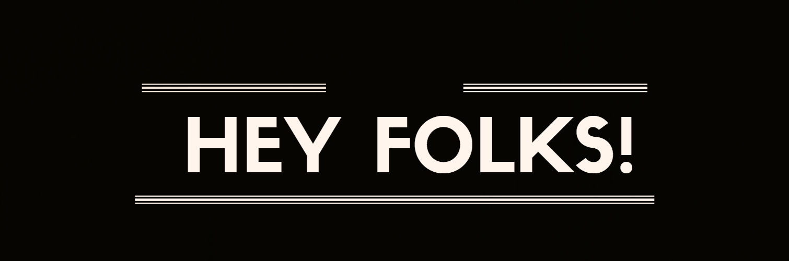

# Hello! /  Olá!

[EN] My name is Mario Albano and currently i'm a student in the area of web development.

Currently working as an administrative assistant looking for a career transfer. Passionate about technology and learning new languages. I'm always looking for more knowledge and challenges.

I recently challenged myself to study programming every day (even on weekends and holidays) and commit whenever possible 🏋️!

Latest projects:  

<a href="https://marioalbano.github.io/Portfolio/">Portfolio</a> |
<a href="https://marioalbano.github.io/Bikcraft/">Bikcraft</a> |
<a href="https://marioalbano.github.io/Tindog/">Tindog</a>

-----------------------------------------------------------------------------------------------------------------------------------------------------------------------

[BR] Sou Mario Albano e atualmente sou um estudante na área de desenvolvimento web.

Estou trabalhando como assistente administrativo, procurando por uma transferência de carreira. Apaixonado por tecnologia e sobre aprender novas línguas. Eu estou sempre procurando por mais conhecimentos e desafios.

Recentemente desafiei a mim mesmo a estudar programação todos os dias (inclusive nos finais de semanas e feriados) e sempre que possível fazer um commit 🏋️!

Últimos projetos:  

<a href="https://marioalbano.github.io/Portfolio/">Portfolio</a> |
<a href="https://marioalbano.github.io/Bikcraft/">Bikcraft</a> |
<a href="https://marioalbano.github.io/Tindog/">Tindog</a>

-----------------------------------------------------------------------------------------------------------------------------------------------------------------------

## 🔧 Technologies & Tools
 

 
 
## &#x1f4c8; GitHub Stats
 
 
